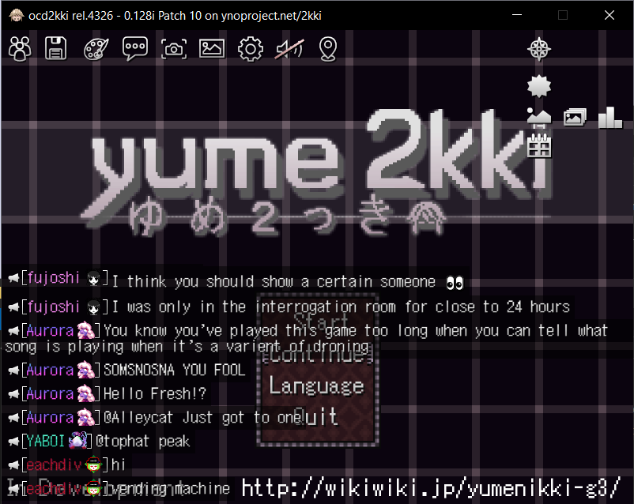
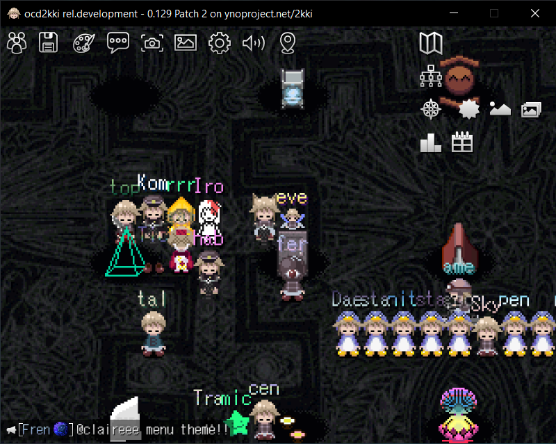
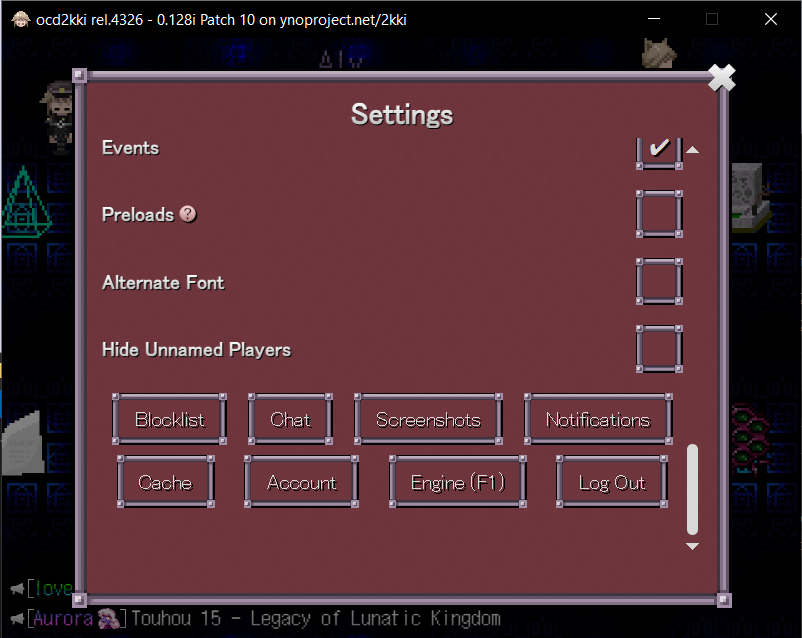
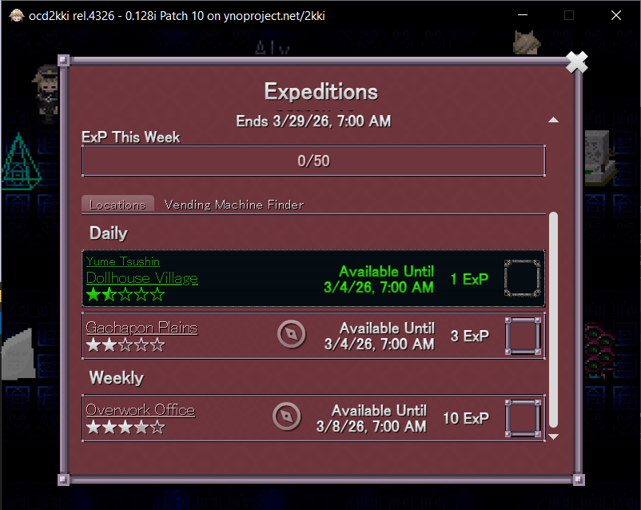

# ocd2kki

an unofficial desktop client of yume 2kki on ynoproject.net (yume nikki online project)

# screenshots

 
 
 

# how

ocd2kki is using neutralinojs, by using user's available browsers or webview for displaying "[https://ynoproject.net/2kki/](https://ynoproject.net/2kki/)" and inject a custom interface for more "native-like" experience.

ocd2kki isn't hosting or stealing any ynoproject or yume 2kki developers assets or gamedata.

ocd2kki is open-source at [https://github.com/kinnnine/ocd2kki](https://github.com/kinnnine/ocd2kki)

# why

- separate from your main browser
- native-like experience
- lightweight download (only 3mb)

# features

- window size is cropped and fit to a game screen
- menu buttons when hovering top of game screen
- quit the game from main menu works

# downside

- not a truly native application, it's a desktop web app duh

# build

requirements:

- node
- npm or pnpm
- neutralinojs/neu

install neutralinojs cli
``
npm install -g @neutralinojs/neu
``

build release
``
./make.sh build
``

development run
``
./make.sh run
``

# history

ocd2kki was originally created on nwjs but due to stupidity cloudflare turnstile won't play nicely, thanks to neutralinojs for solving this issue by replacing nw.js entirely.

### things to point out on nwjs

- embedded with chromium, doesn't need user's system browser
- iframe with nwfaketop work flawlessly, able to load any remote url
- iframe with onload function gives you lemon

### but

- weird issue with useragent thingy
- you can play just fine but unable to sign-in or even register due to cloudflare turnstile

### what's good?

- i don't need to rewrite the script since the way neutralinojs works, similar to iframe onload injection but use "injectScript" inside neutralino.config.json
- friendship ended with nwjs's iframe, now neutralinojs with user's system webview is my best friend
- you can now sign-in, hell yeah

that's it.

# roadmap

- [ ] able to chat
- [ ] toast notification
- [ ] ocd2kki-specific settings
- [ ] fix badges floating modal size
- [ ] fix right menu buttons position
- [ ] discord rpc
- [ ] supports other fangames from ynoproject
- [ ] rewrite in rust/tauri
