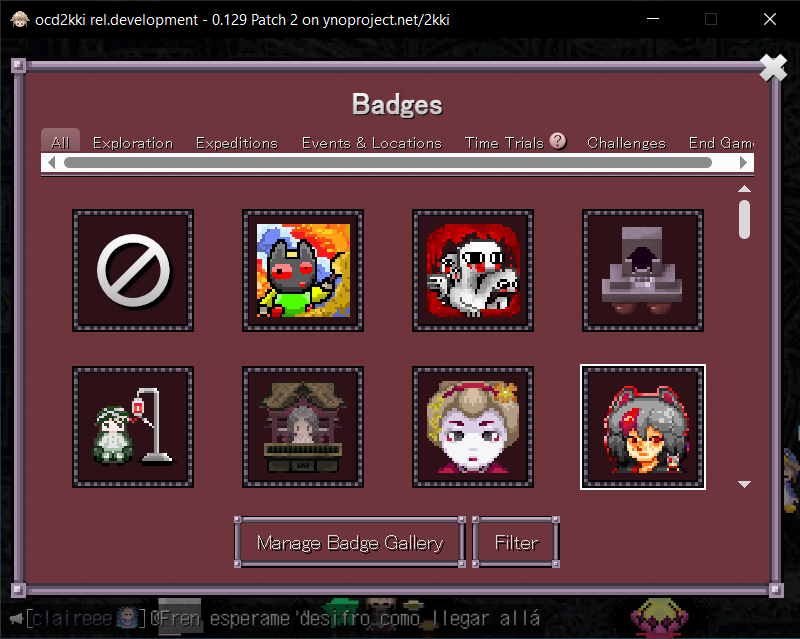
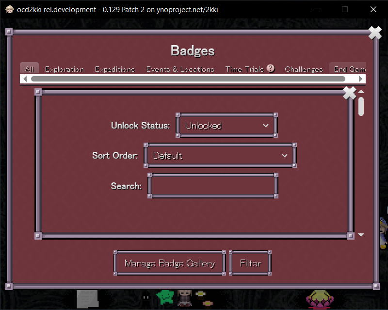
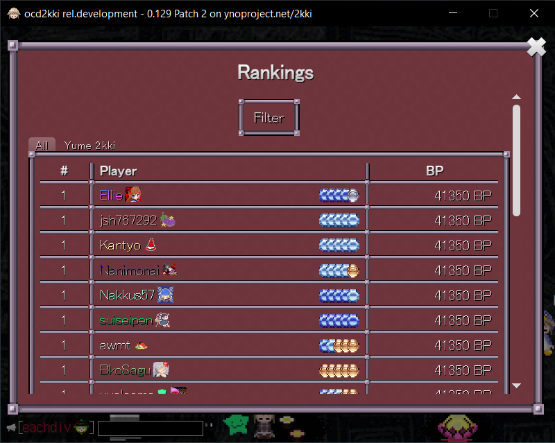
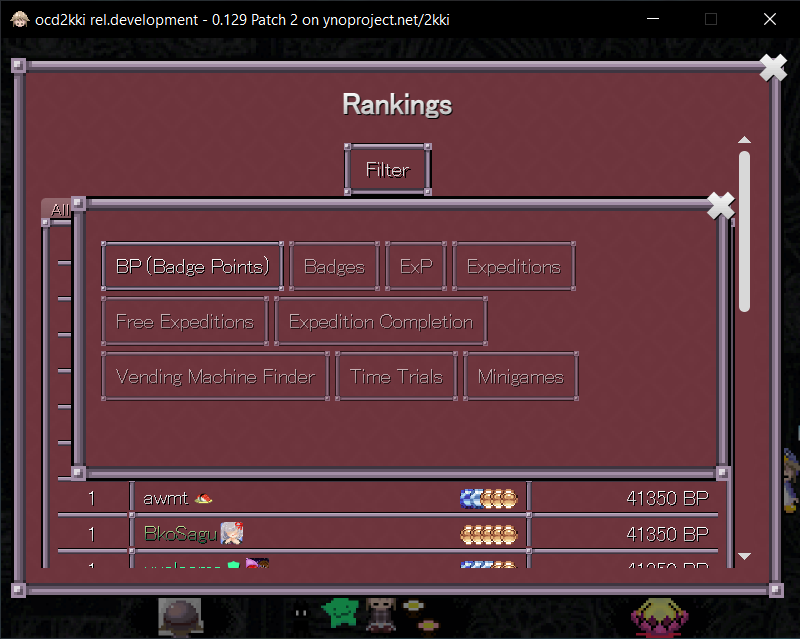

# ocd2kki

> [!NOTE]
> ocd2kki isn't hosting, stealing or containing any YNOproject or Yume 2kki developers assets or gamedata, except urotsuki.png for the icon inside this repository.

An unofficial desktop client of Yume 2kki on ynoproject.net (Yume Nikki Online Project)

# Screenshots

Main Menu

In-game

Settings (Minor UI changes)

Both login and logout button are moved into settings.

Badges (Major UI changes)

Filtering options are moved into its own window to fix visibility issue.

 

Rankings (Major UI changes)

Filtering options are moved into its own window to fix visibility issue.

 

# How

ocd2kki is using NeutralinoJS, by using user's available browsers or webview for displaying "[https://ynoproject.net/2kki/](https://ynoproject.net/2kki/)" and inject a custom interface for more "native-like" experience.

ocd2kki is open-source at [https://github.com/kinnnine/ocd2kki](https://github.com/kinnnine/ocd2kki)

# Why

- Separate from your main browser
- Native-Like experience
- Lightweight download (only 3mb)

# Features

- Window size is cropped and fit to a game screen
- Menu buttons when hovering top of game screen
- Quit the game from main menu works

# Build

Requirements:

- node
- npm or pnpm
- neutralinojs/neu

Install neutralinojs CLI
``
npm install -g @neutralinojs/neu
``

Build release
``
./make.sh build
``

Development run
``
./make.sh run
``

# History

ocd2kki was originally created on NW.js but due to stupidity cloudflare turnstile won't play nicely, thanks to NeutralinoJS for solving this issue by replacing NW.js entirely.

### Things to point out on NW.js

- Embedded with chromium, doesn't need user's system browser
- iframe with nwfaketop work flawlessly, able to load any remote url
- iframe with onload function gives you lemon

### But

- Weird issue with useragent thingy
- You can play just fine but unable to sign-in or even register due to cloudflare turnstile

### Any good news?

- I don't need to rewrite the script since the way NeutralinoJS works, similar to iframe onload injection but use "injectScript" inside neutralino.config.json
- Friendship ended with NW.js iframe, now NeutralinoJS with user's system webview is my best friend
- You can now sign-in, hell yeah

That's it.

# Roadmap

- [ ] Able to chat
- [x] Toast notification
- [ ] ocd2kki-specific settings
- [x] Fix badges floating modal size
- [x] Fix right menu buttons position
- [ ] Discord RPC
- [ ] Supports other fangames from YNOProject
- [ ] Rewrite in Rust/Tauri
